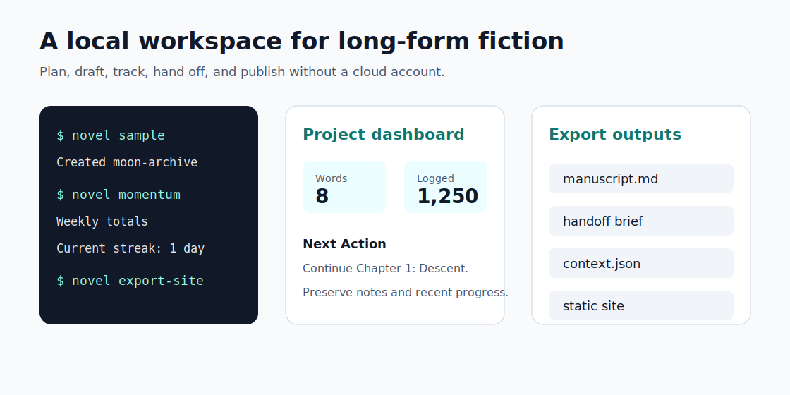
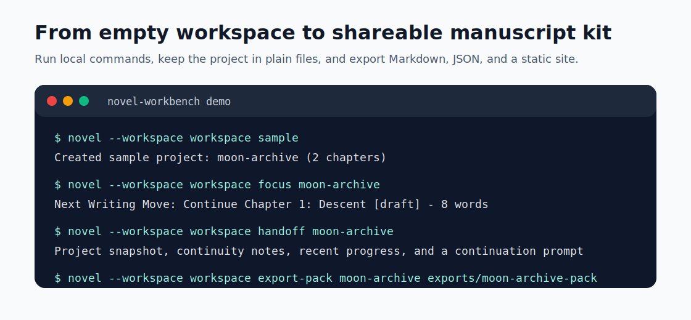

# Novel Workbench

[](https://github.com/xinjian0101/novel-workbench/actions/workflows/ci.yml)
[](https://github.com/xinjian0101/novel-workbench/actions/workflows/pages.yml)
[](https://github.com/xinjian0101/novel-workbench/releases/latest)
[](https://github.com/xinjian0101/novel-workbench/stargazers)
[](https://codespaces.new/xinjian0101/novel-workbench?quickstart=1)
[](https://www.python.org/)
[](LICENSE)
[](https://github.com/xinjian0101/novel-workbench/topics)

Novel Workbench is a fast, local-first command line workspace for writing long-form fiction. It gives authors a simple way to create projects, draft chapters, track progress, and export a clean Markdown manuscript without signing up for a cloud service.

Live demo: [xinjian0101.github.io/novel-workbench](https://xinjian0101.github.io/novel-workbench/)

Latest release: [v0.1.1](https://github.com/xinjian0101/novel-workbench/releases/tag/v0.1.1)

Launch announcement: [GitHub Discussion #7](https://github.com/xinjian0101/novel-workbench/discussions/7)

## At a Glance

| Signal | Proof |
|---|---|
| Local-first | No account, server, database, telemetry, or background network calls. |
| Fastest try path | `python -m pip install "git+https://github.com/xinjian0101/novel-workbench.git"` then `novel --workspace workspace tour --output-dir exports`. |
| Cloud try path | Open a disposable GitHub Codespaces environment using [docs/CODESPACES.md](docs/CODESPACES.md). |
| Shareable proof | Live demo, terminal demo, output examples, and static HTML export are all generated from repository commands. |
| Star fit | See [docs/EVALUATION.md](docs/EVALUATION.md) for star signals, share targets, and contribution fit. |





```text
$ novel sample
Created sample project: moon-archive (2 chapters)

$ novel stats moon-archive
Chapters: 2
Notes: 0
Words: 15
Logged words: 0
Writing days: 0
Current streak: 0 days
Longest streak: 0 days
Target words: 80000
Remaining words: 79985
Progress: 0%
Average chapter words: 8
Characters: 77
Draft: 2 chapters / 15 words
Revising: 0 chapters / 0 words
Done: 0 chapters / 0 words

$ novel search moon-archive signal
Chapter 1: Signal [draft]
   The first signal arrived at 03:17.
```

## Install

Install directly from GitHub:

```powershell
python -m pip install "git+https://github.com/xinjian0101/novel-workbench.git"
```

Or install the verified `v0.1.1` wheel from GitHub Releases:

```powershell
python -m pip install "https://github.com/xinjian0101/novel-workbench/releases/download/v0.1.1/novel_workbench-0.1.1-py3-none-any.whl"
```

For local development, clone the repository and install it editable:

```powershell
python -m pip install -e ".[dev]"
```

Or use GitHub Codespaces for a disposable development environment. See [docs/CODESPACES.md](docs/CODESPACES.md).

## 60-Second Tour

Run the one-command tour:

```powershell
novel --workspace workspace tour --output-dir exports
```

For the shortest first run after installation:

```powershell
novel try
```

It creates or reuses the sample project, prints the next writing focus, exports AI/editor context JSON, writes a static HTML site, and builds a complete Markdown report pack.

Or run the steps manually:

```powershell
novel --workspace workspace sample
novel --workspace workspace focus moon-archive
novel --workspace workspace handoff moon-archive
novel --workspace workspace context moon-archive
novel --workspace workspace momentum moon-archive
novel --workspace workspace export-site moon-archive exports/moon-archive-site
novel --workspace workspace export-pack moon-archive exports/moon-archive-pack
```

The tour creates a sample novel workspace, shows the next writing move, prepares an AI/editor handoff brief, prints machine-readable project context JSON, summarizes drafting momentum, writes a static HTML project site, and exports a complete Markdown report pack.

## Use Cases

| Use case | What it gives you |
|---|---|
| Author drafting workspace | Chapters, scenes, notes, progress, deadlines, and Markdown export in local files. |
| Local-first manuscript archive | UTF-8 JSON projects, safety snapshots, backups, restore, doctor, and migration checks. |
| AI or editor handoff | Focus briefs, continuation prompts, revision checklists, and project context JSON. |
| Static project demo | Exportable HTML dashboard, manuscript page, and context JSON for GitHub Pages or any static host. |

See [docs/USE_CASES.md](docs/USE_CASES.md) for workflow examples and fit guidance.

See [docs/EDITOR_WORKFLOWS.md](docs/EDITOR_WORKFLOWS.md) for VS Code, Markdown vault, AI/editor handoff, and Git review recipes.

See [docs/OUTPUT_EXAMPLES.md](docs/OUTPUT_EXAMPLES.md) for sample Markdown, handoff, context JSON, static site, and report-pack outputs.

Common privacy, install, import, and export questions are answered in [docs/FAQ.md](docs/FAQ.md).

Use [docs/EVALUATION.md](docs/EVALUATION.md) for a two-minute fit check before starring, sharing, or contributing.

## Why Star It

- Local-first writing data: no account, server, database, or telemetry.
- Plain exports: Markdown reports, context JSON, and static HTML sites.
- Automation-friendly: every workflow can run from the CLI and fit into Git-based writing systems.
- AI/editor ready: handoff briefs and project context JSON are built in.

See [docs/POSITIONING.md](docs/POSITIONING.md) for comparison notes, tradeoffs, and project fit.

See [docs/EVALUATION.md](docs/EVALUATION.md) for the fastest proof, star signals, share targets, and contribution fit.

## Why It Exists

Most writing apps are either too heavy for developers and terminal users, or too cloud-dependent for private drafts. Novel Workbench keeps the core workflow plain:

- one command line tool
- one local workspace directory
- UTF-8 JSON project files
- Markdown export that can go into Git, editors, static sites, or publishing tools

## Features

- Create and list novel projects
- Create a sample project for instant exploration
- Generate importable starter manuscript templates for three-act, hero-journey, mystery, romance, sci-fi, and thriller drafts
- Rename project slugs and titles without losing chapters
- Track project genre, audience, and revision notes
- Add chapters with draft, revising, and done statuses
- Add chapter outline summaries
- Break chapters into scene outlines
- Move chapters and keep numbering consistent
- Delete chapters and automatically close numbering gaps
- Update chapter title, content, and status
- Track project notes for characters, locations, plot, research, and general planning
- Add structured character and location notes with dedicated commands
- Update project notes as plans evolve
- Log writing sessions by date and words written
- Correct or delete writing log entries when plans change
- Track current and longest writing streaks
- Set a target completion date and calculate required daily writing pace
- Review every project in a workspace dashboard
- Export workspace dashboard reports to Markdown
- Show a daily focus brief with the next writing move and recent progress
- Show an AI/editor handoff brief with project context and a continuation prompt
- Print machine-readable AI/editor project context JSON for automation and handoffs
- Show writing momentum reports with weekly totals and recent entries
- Group chapters into a status board for draft, revising, and done work
- Show structured project outlines
- Show a full planning view with metadata, progress, chapters, scenes, notes, and writing logs
- Review manuscript readiness with findings for missing setup, empty chapters, open scenes, and progress gaps
- Generate revision checklists from chapter status, scene status, notes, and revision notes
- Report chapter, word, character, status, and average chapter counts
- Track target word count progress and remaining words
- Search across chapter titles, manuscript content, and project notes
- Import a Markdown manuscript into a structured project
- Export manuscripts to Markdown
- Export a complete project report pack in one command
- Export AI/editor project context JSON for tools that need structured project state
- Export a static HTML project site with dashboard, manuscript, and context JSON files
- Export with optional YAML front matter for publishing tools
- Export shareable outline documents with chapter summaries and scene beats
- Export shareable writing momentum reports with weekly progress rollups
- Export shareable progress reports with chapter, status, target, and streak tables
- Export shareable revision checklists for manuscript edit passes
- Export a share kit with pitch copy, static site, and report pack assets
- Export SVG social preview cards for project announcements and launch posts
- Export channel-ready launch copy for social posts, community posts, awesome-list entries, and follow-up replies
- Export a share-kit outreach plan that maps generated assets to directory, forum, writing-community, and newsletter submissions
- Export through custom Markdown template files
- Automatically snapshot project JSON before renames and destructive deletes
- Back up project JSON on demand
- Restore project JSON from backups with explicit overwrite protection
- Validate workspace health before releases or migrations, with repair hints
- Migrate legacy project JSON files to the current schema with safety snapshots
- Print shell completion scripts for bash, zsh, and PowerShell
- Run fully offline with no account, server, database, or telemetry

## Full Local Development Quick Start

```powershell
python -m venv .venv
.\.venv\Scripts\Activate.ps1
python -m pip install --upgrade pip
python -m pip install -e ".[dev]"

novel --workspace workspace init
novel --workspace workspace starter drafts/working-title.md --template three-act
novel --workspace workspace import-markdown working-title drafts/working-title.md
novel --workspace workspace rename working-title first-draft --title "First Draft"
novel --workspace workspace sample
novel --workspace workspace set-metadata moon-archive --genre "science fiction" --audience adult --revision-notes "Lean into the discovery mystery."
novel --workspace workspace update-chapter moon-archive 1 --summary "The discovery pulls the crew below the surface."
novel --workspace workspace add-scene moon-archive 1 "Signal discovered" --summary "The crew finds the first active relay."
novel --workspace workspace list-scenes moon-archive 1
novel --workspace workspace board moon-archive
novel --workspace workspace outline moon-archive
novel --workspace workspace plan moon-archive
novel --workspace workspace review moon-archive
novel --workspace workspace revision moon-archive
novel --workspace workspace move-chapter moon-archive 2 1
novel --workspace workspace delete-chapter moon-archive 2
novel --workspace workspace add-character moon-archive "Ada" --role protagonist --goal "Decode the archive signal."
novel --workspace workspace add-location moon-archive "Archive Vault" --description "A sealed records chamber below the city."
novel --workspace workspace add-note moon-archive "Underground rain" --kind plot --content "The moon city has weather below the dust."
novel --workspace workspace update-note moon-archive 1 --kind research --content "The lower city has sealed storm drains."
novel --workspace workspace list-notes moon-archive
novel --workspace workspace add-progress moon-archive 1200 --date 2026-06-26 --note "Drafted the descent sequence."
novel --workspace workspace update-progress moon-archive 1 --words 1250 --note "Included evening revisions."
novel --workspace workspace list-progress moon-archive
novel --workspace workspace set-target moon-archive 80000
novel --workspace workspace set-deadline moon-archive 2026-12-31
novel --workspace workspace dashboard
novel --workspace workspace export-dashboard exports/workspace-dashboard.md
novel --workspace workspace focus moon-archive
novel --workspace workspace handoff moon-archive
novel --workspace workspace context moon-archive
novel --workspace workspace momentum moon-archive
novel --workspace workspace stats moon-archive
novel --workspace workspace doctor
novel --workspace workspace migrate --dry-run
novel --workspace workspace search moon-archive rain
novel --workspace workspace export moon-archive exports/moon-archive.md
novel --workspace workspace export moon-archive exports/moon-archive-focus.md --template focus
novel --workspace workspace export moon-archive exports/moon-archive-handoff.md --template handoff
novel --workspace workspace export moon-archive exports/moon-archive-momentum.md --template momentum
novel --workspace workspace export moon-archive exports/moon-archive-board.md --template board
novel --workspace workspace export moon-archive exports/moon-archive-outline.md --template outline
novel --workspace workspace export moon-archive exports/moon-archive-frontmatter.md --template frontmatter
novel --workspace workspace export moon-archive exports/moon-archive-progress.md --template progress
novel --workspace workspace export moon-archive exports/moon-archive-review.md --template review
novel --workspace workspace export moon-archive exports/moon-archive-revision.md --template revision
novel --workspace workspace export-context moon-archive exports/moon-archive-context.json
novel --workspace workspace export-site moon-archive exports/moon-archive-site
novel --workspace workspace social-card moon-archive exports/moon-archive-social-card.svg
novel --workspace workspace launch-copy moon-archive exports/moon-archive-launch-copy.md
novel --workspace workspace export-pack moon-archive exports/moon-archive-pack
novel --workspace workspace share-kit moon-archive exports/moon-archive-share
novel --workspace workspace backup moon-archive backups
novel --workspace workspace restore-backup backups/moon-archive-20260626T120000000000Z.json --force
```

Run the bundled demo:

```powershell
python scripts/demo.py
```

Build the GitHub Pages demo site locally:

```powershell
python scripts/build_pages_demo.py public
```

## Commands

```text
novel init
novel list
novel dashboard
novel export-dashboard <output.md>
novel doctor
novel migrate [--dry-run]
novel tour [--slug moon-archive] [--output-dir exports]
novel try [--slug moon-archive] [--output-dir exports]
novel templates
novel completion bash|zsh|powershell
novel sample [--slug moon-archive]
novel starter <output.md> [--template three-act|hero-journey|mystery|romance|sci-fi|thriller] [--force]
novel create <slug> <title> [--synopsis "..."] [--genre "..."] [--audience "..."]
novel rename <slug> <new-slug> [--title "..."]
novel import-markdown <slug> <input.md>
novel show <slug>
novel focus <slug>
novel handoff <slug>
novel context <slug>
novel momentum <slug>
novel board <slug>
novel outline <slug>
novel pitch <slug>
novel plan <slug>
novel review <slug>
novel revision <slug>
novel stats <slug>
novel set-metadata <slug> [--genre "..."] [--audience "..."] [--revision-notes "..."] [--revision-notes-file path]
novel set-target <slug> <words>
novel clear-target <slug>
novel set-deadline <slug> <YYYY-MM-DD>
novel clear-deadline <slug>
novel add-character <slug> <name> [--role "..."] [--goal "..."] [--conflict "..."] [--arc "..."] [--notes "..."] [--notes-file path]
novel add-location <slug> <name> [--description "..."] [--mood "..."] [--importance "..."] [--notes "..."] [--notes-file path]
novel add-note <slug> <title> [--kind general|character|location|plot|research] [--content "..."] [--content-file path]
novel list-notes <slug> [--kind general|character|location|plot|research]
novel update-note <slug> <id> [--title "..."] [--kind general|character|location|plot|research] [--content "..."] [--content-file path]
novel delete-note <slug> <id>
novel add-progress <slug> <words> [--date YYYY-MM-DD] [--note "..."]
novel list-progress <slug>
novel update-progress <slug> <id> [--date YYYY-MM-DD] [--words N] [--note "..."]
novel delete-progress <slug> <id>
novel search <slug> <query>
novel add-chapter <slug> <title> [--content "..."] [--summary "..."] [--summary-file path] [--status draft|revising|done]
novel update-chapter <slug> <number> [--title "..."] [--content "..."] [--content-file path] [--summary "..."] [--summary-file path] [--status draft|revising|done]
novel move-chapter <slug> <number> <new-number>
novel delete-chapter <slug> <number>
novel add-scene <slug> <chapter> <title> [--summary "..."] [--summary-file path] [--status draft|revising|done]
novel list-scenes <slug> <chapter>
novel update-scene <slug> <chapter> <scene> [--title "..."] [--summary "..."] [--summary-file path] [--status draft|revising|done]
novel delete-scene <slug> <chapter> <scene>
novel export <slug> <output.md> [--template board|default|focus|frontmatter|handoff|momentum|outline|pitch|progress|review|revision] [--template-file path]
novel export-context <slug> <output.json>
novel export-site <slug> <output-dir> [--theme classic|editorial|focus] [--base-url https://example.com/site]
novel social-card <slug> <output.svg> [--theme classic|editorial|focus]
novel launch-copy <slug> <output.md> [--base-url https://example.com/site]
novel export-pack <slug> <output-dir>
novel share-kit <slug> <output-dir> [--theme classic|editorial|focus] [--base-url https://example.com/site]
novel backup <slug> <output-dir>
novel restore-backup <backup.json> [--force]
```

Use `--workspace <dir>` with any command to choose the workspace directory. If omitted, the tool uses `NOVEL_WORKBENCH_HOME`, then falls back to `./workspace`.

See [docs/CLI_REFERENCE.md](docs/CLI_REFERENCE.md) for command details and examples. Shell completion setup lives in [docs/SHELL_COMPLETION.md](docs/SHELL_COMPLETION.md). Project file details live in [docs/PROJECT_SCHEMA.md](docs/PROJECT_SCHEMA.md).

## Data Layout

```text
workspace/
  projects/
    first-novel.json
  backups/
    first-novel-delete-chapter-20260626T120000000000Z.json
exports/
  first-novel.md
backups/
  first-novel-2026-06-25T120000Z0000.json
```

Project files are JSON so they can be reviewed, versioned, backed up, and migrated without a proprietary database.
Automatic safety snapshots are stored under `workspace/backups/` before project renames, chapter deletion, and note deletion. The `backup` command can still copy a project JSON file to any directory you choose.
Use `restore-backup` to restore a project JSON file. If a project with the same slug already exists, pass `--force`; Novel Workbench snapshots the current project before overwriting it.

## Custom Export Templates

Use `--template-file` when you need a project-specific Markdown layout:

```markdown
# {title} Brief

{synopsis}

{status_summary}

{chapter_table}
```

```powershell
novel --workspace workspace export moon-archive exports/moon-archive-brief.md --template-file templates/brief.md
```

## Markdown Import Format

```markdown
# Project Title

Optional synopsis.

## Chapter 1: Opening

Chapter text.

## Chapter 2: The Turn

More chapter text.
```

## Development

Install development dependencies:

```powershell
python -m pip install -e ".[dev]"
```

Run checks:

```powershell
python scripts/check.py
```

Run the packaging smoke test by itself:

```powershell
python scripts/release_check.py
```

Architecture notes live in [docs/ARCHITECTURE.md](docs/ARCHITECTURE.md). Packaging and release steps live in [docs/PACKAGING.md](docs/PACKAGING.md).

PyPI publishing preparation lives in [docs/PYPI_PUBLISHING.md](docs/PYPI_PUBLISHING.md). The repository documents the package-index path, but the current install command intentionally uses GitHub until a maintainer completes the external PyPI release.

## Configuration

Copy `.env.example` if you want a fixed local workspace setting:

```powershell
Copy-Item .env.example .env
```

Supported variables:

- `NOVEL_WORKBENCH_HOME`: default workspace directory for `novel`.

## Roadmap

See [ROADMAP.md](ROADMAP.md) for near-term examples, static-site polish, editor workflow coverage, import validation, PyPI publishing, and longer-term local-first extensions. The current project intentionally starts with a small, reliable local core before adding richer writing workflows.

## GitHub Launch

Use [docs/GITHUB_LAUNCH.md](docs/GITHUB_LAUNCH.md) before publishing the repository. It covers repository description, topics, release notes, CI, and README checks.

Use [docs/LAUNCH_KIT.md](docs/LAUNCH_KIT.md) for demo links, launch posts, and submission checklists.

Use [docs/DISTRIBUTION.md](docs/DISTRIBUTION.md) for channel-specific submission copy and follow-up signals.

Use [docs/SHOWCASE.md](docs/SHOWCASE.md) for visual preview assets and demo proof points.

Use [docs/OUTPUT_EXAMPLES.md](docs/OUTPUT_EXAMPLES.md) to inspect generated Markdown, JSON, static-site, and report-pack examples.

Use [docs/USE_CASES.md](docs/USE_CASES.md) to match Novel Workbench to author, archive, AI handoff, and static demo workflows.

Use [docs/EDITOR_WORKFLOWS.md](docs/EDITOR_WORKFLOWS.md) for editor handoff recipes with VS Code, Markdown vaults, AI tools, and Git review.

Use [docs/POSITIONING.md](docs/POSITIONING.md) for comparison notes and launch positioning.

Use [docs/FAQ.md](docs/FAQ.md) for privacy, install, import, export, and PyPI status answers.

## Contributing

Contributions are welcome. Start with [CONTRIBUTING.md](CONTRIBUTING.md), then open a focused issue or pull request.

First-time contributors can follow [docs/FIRST_PR.md](docs/FIRST_PR.md).

Community and issue labels are described in [docs/COMMUNITY.md](docs/COMMUNITY.md).

Codespaces setup for no-local-install contributions is documented in [docs/CODESPACES.md](docs/CODESPACES.md).

Maintainer review routing, release gates, and public milestone checks are documented in [docs/MAINTAINER_GUIDE.md](docs/MAINTAINER_GUIDE.md).

Current contributor entry points include [#9 editor workflow recipes](https://github.com/xinjian0101/novel-workbench/issues/9) and [#8 local editor handoff workflow](https://github.com/xinjian0101/novel-workbench/issues/8).

The public launch announcement lives in [GitHub Discussion #7](https://github.com/xinjian0101/novel-workbench/discussions/7).

## Security

Novel Workbench is local-first and does not transmit manuscripts. Report security concerns through [SECURITY.md](SECURITY.md).

## License

MIT. See [LICENSE](LICENSE).
